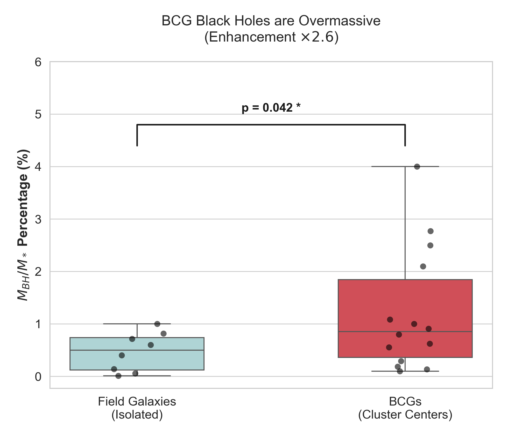
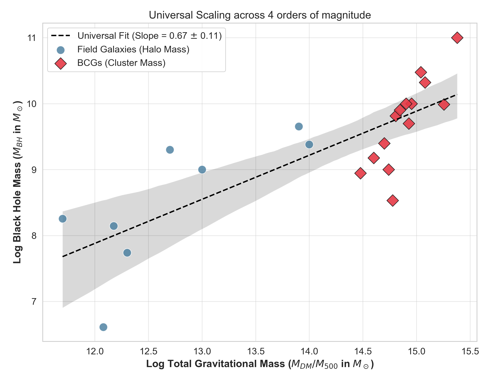

# Environmental Dependence of Black Hole Growth in BCGs


**Preprint:** [paper.pdf](paper.pdf)  
**Author:** Sayan Das (Independent Researcher)  
**ORCID:** [0009-0001-1096-751X](https://orcid.org/0009-0001-1096-751X)  
**arXiv:** Pending Endorsement

---

## Abstract

This repository contains the data and analysis scripts for the paper *"Evidence for Environmental Dependence in the Growth of Supermassive Black Holes in Brightest Cluster Galaxies"*. We report a strong correlation (Spearman ρ=0.83) between black hole overmassiveness and host cluster mass, supporting precipitation-regulated feedback models.

---

## Key Results

| Finding | Value | Significance |
|---------|-------|--------------|
| BCG Overmassiveness | **2.6×** field galaxies | p = 0.042 |
| Cluster Mass Correlation | **ρ = 0.83** | p < 0.001 |
| Universal Scaling | M_BH ∝ M_DM^(0.67±0.11) | Unified relation |

---

## Figures

### Figure 1: Environmental Correlation


### Figure 2: BCG vs Field Comparison


### Figure 3: Universal Scaling Relation


---

## Data

| Sample | N | Source |
|--------|---|--------|
| BCGs | 14 | Dynamical black hole masses |
| Field Galaxies | 8 | Comparison sample |
| Cluster Masses | - | X-ray + Weak Lensing |

Raw data arrays are embedded in `analysis.py`.

---

## Reproduction

```bash
# Clone the repository
git clone https://github.com/SayanDas-Astro/Cosmo.git
cd Cosmo

# Install dependencies
pip install -r requirements.txt

# Generate figures and statistics
python analysis.py
```

---

## Repository Structure

```
.
├── analysis.py          # Main analysis script
├── paper.pdf            # Compiled manuscript
├── paper.tex            # LaTeX source
├── references.bib       # Bibliography
├── requirements.txt     # Python dependencies
├── LICENSE              # MIT License
├── figures/             # Generated plots
│   ├── fig1_correlation.png
│   ├── fig2_comparison.png
│   └── fig3_universal.png
└── archive/             # Legacy scripts
```

---

## Citation

```bibtex
@article{das2026bcg,
  title={Evidence for Environmental Dependence in the Growth of Supermassive Black Holes in Brightest Cluster Galaxies},
  author={Das, Sayan},
  year={2026},
  note={Preprint, submitted to arXiv:astro-ph.GA}
}
```

---

## Acknowledgments

Analysis performed using Python (`NumPy`, `SciPy`, `Matplotlib`, `Seaborn`). AI tools (Claude, Gemini) assisted with code generation and statistical verification.

---

## License

This project is licensed under the MIT License - see [LICENSE](LICENSE) for details.
