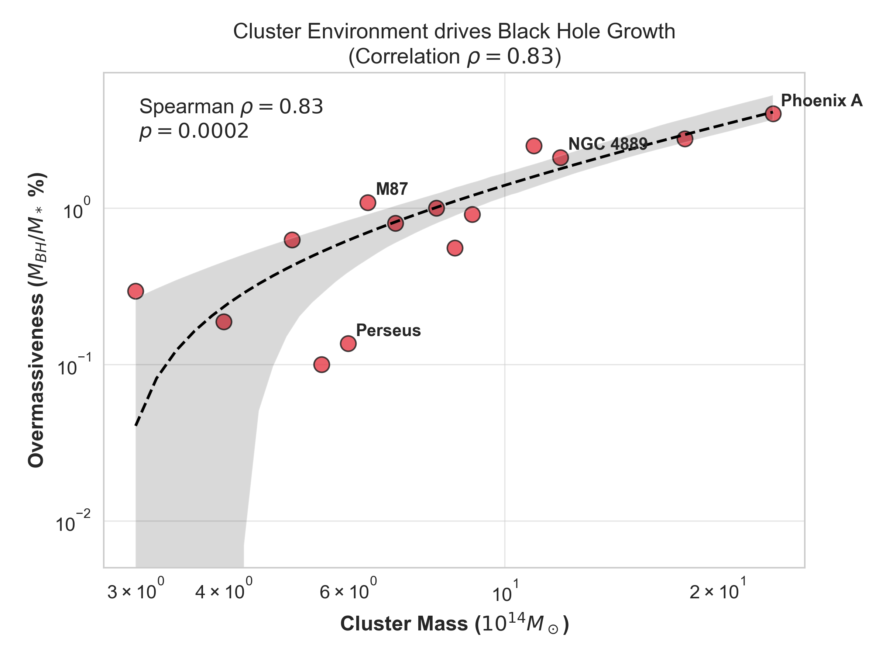

# Environmental Dependence of Black Hole Growth in BCGs

**preprint:** [paper.pdf](paper.pdf)  
**Author:** Sayan Das (Independent Researcher)  
**arXiv:** [Pending Endorsement]

## Abstract
This repository contains the data and analysis scripts for the paper *"Evidence for Environmental Dependence in the Growth of Supermassive Black Holes in Brightest Cluster Galaxies"*. We report a strong correlation (Spearman $\rho=0.83$) between black hole overmassiveness and host cluster mass, supporting precipitation-regulated feedback models.

## Repository Contents
*   **`paper.pdf`**: The final compiled manuscript.
*   **`analysis.py`**: Main Python script (reproduces all tests and figures).
*   **`figures/`**: Generated plots (Figures 1-3).
*   **`archive/`**: Legacy/Backup scripts.
*   **`paper.tex`**: LaTeX source code.
*   **`references.bib`**: BibTeX bibliography.

## Visuals


## Reproduction
To reproduce the figures and statistics:
```bash
pip install numpy matplotlib scipy seaborn pandas
python analysis.py
```

## Citation
```bibtex
@article{das2026bcg,
  title={Evidence for Environmental Dependence in the Growth of Supermassive Black Holes in Brightest Cluster Galaxies},
  author={Das, Sayan},
  year={2026},
  publisher={GitHub},
  journal={Preprint}
}
```
